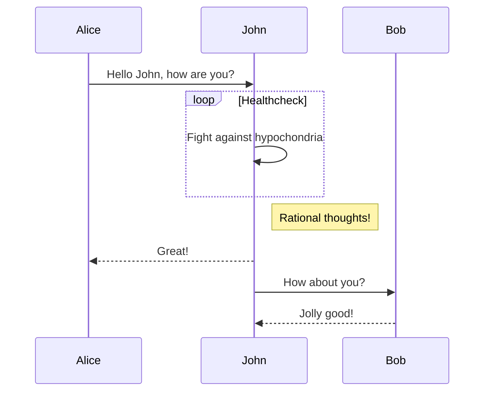

### Intention
The service tends to be a mock web server able to test the pipelines of requests.

The typical case can be depicted as follows:
- there is a pipeline which needs to send some information to the server 
then in accordance with the server response process some logic and send the information back to the server. 
- the server needs to receive a certain amount of events thereby we need to somehow send the group of messages regularly or one-time.

### Overall functions
 The server consists of the following modules:
 - 

### Json generator

### Endpoints and Parcels

#### Examples
- send generated jsons in parallel to the endpoint
- send a json, get a response, wait, send a new one or to another endpoint
- send a json, if the resp is 200 then do one thing if the resp is another do another thing.
- send a json, get a response, send a json with the information from the response.
...  
 